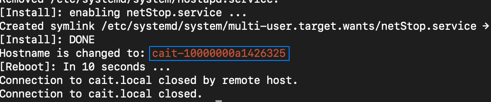

<div align="center">
    
</div>
<br>

|**`Documentation`** | |
------------------- |-----|
|[](https://michaelnhw.github.io/test_page/) | [](https://michaelnhw.github.io/test_page/) |

## CAIT

The Cortic A.I. Toolkit, or CAIT for short, is a software package that enables makers and students to learn and experiment with A.I. algorithms on the popular Raspberry Pi 4B single board computer.  Our goal is to eliminate complicated software setup and allow people to easily integrate A.I. into their own projects.  We take a container based approach and pre-installed many state-of-the-art open source A.I. software packages/frameworks into cohesive docker containers.  We link these containers into a single system by employing the lightweight MQTT protocol. We also extended Google's Blockly visual programming language to offer a quick prototyping environment for our users.  CAIT currently has a nubmer of custom A.I. and automation blocks:

* Face detection
* Face recognition
* Object detection, 
* Text to speech 
* Speech to text
* Natural language processing
* LEGO motor control
* Smart home device control

All of these custom blocks are backed by a simple Python API.  You may choose to program directly using this API for added flexibility and power.  In fact, if you already have a running project that uses the visual programming interface, you can easily convert it into Python code using our automated conversion tool.  

## Hardware

Here is a list of hardware components that we currently support.  You may choose a subset of them to suit your own projects.

* Any of Raspberry Pi 4B 2GB/4Gb/8GB models
* Micro SD card (32GB recommended)
* Logitech USB webcam (C270, C922, C615, C310 are tested)
* Mini speaker with 3.5mm audio jack 
* BrickPi3 LEGO motor control board 
* LEGO Mindstorms EV3 
* Smart home devices such as Philips Hue, smart speakers, etc

We also support the use of Raspberry Pi's CSI camera interface.  However, if your project requires audio/speech input, it's much better to use a USB webcam as it has an integrate microphone.  The integrated mic usually offers much better audio input performance than any of the mini USB mics that we have tested.

## How do I try it

You can try CAIT by downloading the pre-loaded Raspberry Pi OS (32bit) image at https://drive.google.com/file/d/11UH-ez4J30dTUELi-G-8i6ThG6lhFtKz/view?usp=sharing.  You will need to use a 32GB micro SD card for this.  After you boot up from this image, the RPi will advertise itself as a WIFI access point with the ssid "cait".  If you using a different computer to access CAIT, make sure you connect to this WIFI access point first and then visit http://cait.local to start the setup process.  If you are using the RPi as a standalone computer, you can go to http://cait.local directly.

## Installing from source

Before you start, make sure there is at least 16GB of free space on your SD card.  

> :warning: **The latest WIFI firmware (ver. 20190114-1+rpt8) has a known issue that crashes when using a virtual AP interface**: The setup script you are about to run will downgrade this firmware to the 20190114-1+rpt4 version.  Proceed only if you are okay with this downgrade.

```
$ git clone https://github.com/cortictechnology/cait.git
$ cd cait
$ ./setup_cait.sh --ap-ssid=<ssid_name> --ap-password=<ap_password> --ap-country-code=<country_code> --ap-ip-address=<desired_ap_ip> --wifi-interface=<wifi_interface_name>
```

The above setup script starts the raspberry pi in both access point mode and station mode.  The user can provide custom values for the access point name, password, desired ip address, and the wifi ssid name. If no parameters are given, the default values are: 

```
<ssid_name>: "cait" 
<ap_password> : "caitcait" 
<country_code>: "CA" 
<desired_ap_ip>: "10.0.0.1" 
<wifi_interface_name>: "wlan0"
```

After the setup process is completed, the device's hostname is changed to cait-<device_serial_number>.  You can find the exact hostname by looking at the last line of the setup script output.  It should say: "Hostname is changed to: <hostname>", with the new hostname highlighted in <span style="color:red">red</span> as shown below.  Of course, you can always use the raspi-config utility to change the hostname to whatever you like.



## Quick start

Please follow our "Quick Start" guide to get started.  

## How to contribute

We welcome contributions from all our users.  You can contribute by requesting features or reporting bugs under "Issues".  You can also submit proposed code updates through pull requests to our "dev" branch.

## License

[MIT License](LICENSE)
