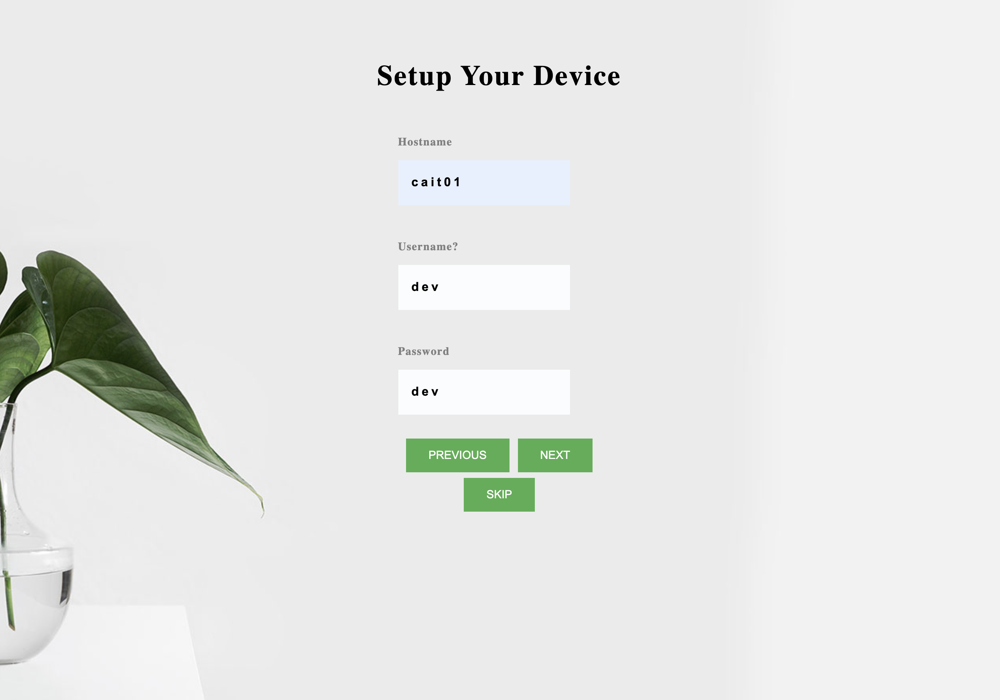
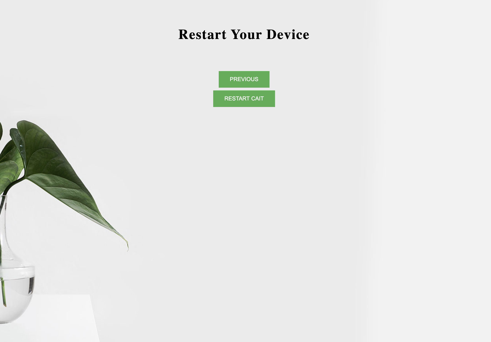

<div align="center">
    
</div>

|**`Documentation`** | |
------------------- |-----|
|[](https://michaelnhw.github.io/test_page/) | [](https://michaelnhw.github.io/test_page/) |


The Cortic A.I. Toolkit, or CAIT for short, is a software package that enables makers and students to learn and experiment with A.I. algorithms on the popular Raspberry Pi 4B single board computer.  There is a lot of interest among various groups of people to setup and experiment with A.I. enabled projects.  However, many of them are turned off by the complicated software setup process and the sharp learning curve required to get an A.I. project up and running.  Additionally, A.I. capable hardware can be an expensive investment.  Our goal is to address these problems and make it extremely simple for people to build projects using a variety of A.I. technology on an inexpensive hardware platform.  We take a container based approach and pre-installed many state-of-the-art open source A.I. software packages/frameworks into a number of cohesive docker containers.  We link these containers into a single system by employing the lightweight MQTT protocol.  Finally, we extend Google's Blockly visual programming alnguage to offer a quick prototyping environment for our users.  CAIT is the result of this effort.  It currently include a nubmer of custom A.I. and automation blocks:

* Face detection
* Face recognition
* Object detection, 
* Text to speech 
* Speech to text
* Natural language processing
* LEGO motor control
* Smart home device control

All of these custom blocks are backed by a simple Python API.  You may choose to program directly using this API for added flexibility and power.  In fact, if you already have a running project that uses the visual programming interface, you can easily convert it into Python code using our automated conversion tool.  

## Hardware requirements

Here is a list of hardware components that we currently support.  You may choose a subset of them to suit your own projects.

* Any of Raspberry Pi 4B 2GB/4Gb/8GB models
* Micro SD card (32GB recommended)
* Logitech USB webcam (C270, C922, C615, C310 are tested)
* Mini speaker with 3.5mm audio jack 
* BrickPi3 LEGO motor control board 
* LEGO Mindstorms EV3 
* Smart home devices such as Philips Hue, smart speakers, etc

We also support the use of Raspberry Pi's CSI camera interface.  However, if your project requires audio/speech input, it's much better to use a USB webcam as it has an integrate microphone.  The integrated mic usually offers much better audio input performance than any of the mini USB mics that we have tested.

## How do I try it

Download the prebuilt raspbian image: 

You'll need to use a micro SD card that is at least 32GB in order for this image to write properly.

Use any image writing tool to clone the image to a sd card, e.g. dd, pi imager.

## Installing from source

Before you start, make sure there is at least 16GB of free space on your SD card.  

> :warning: **The latest WIFI firmware (ver. 20190114-1+rpt8) has a known issue that crashes when using a virtual AP interface**: The setup script you are about to run will downgrade this firmware to the 20190114-1+rpt4 version.  Proceed only if you are okay with this downgrade.

```
$ git clone https://github.com/cortictechnology/cait.git
$ cd cait
$ bash setup_cait.sh --ap-ssid=<ssid_name> --ap-password=<ap_password> --ap-country-code=<country_code> --ap-ip-address=<desired_ap_ip> --wifi-interface=<wifi_interface_name>
```

The above setup script starts the raspberry pi in both access point mode and station mode.  The user can provide custom values for the access point name, password, desired ip address, and the wifi ssid name. If no parameters are given, the default values are: 

```
<ssid_name>: "cait" 
<ap_password> : "caitcait" 
<country_code>: "CA" 
<desired_ap_ip>: "10.0.0.1" 
<wifi_interface_name>: "wlan0"
```

After the setup process is completed, the device's hostname is changed to cait-<device_serial_number>.  You can find the exact hostname by looking at the last line of the setup script output.  It should say: "Changing hostname to:", with the new hostname highlighted in <span style="color:red">red</span>, shown below.  Of course, you can always use the raspi-config utility to change the hostname to whatever you like.


## Quick start

### Using the visual programming interface:

You can connect to the CAIT's visual programming interface using any computer, including the Raspberry Pi 4B that hosts CAIT, on the same local WIFI.  In the web browser, go to:

```
http://<hostname>.local
```

The first time you enter this address, you will be directed to a setup page, in which you will be asked to enter a new device name (hostname), and to create an user account for future login. 



Next, you can test the functionality of any attached camera and audio device, to make sure you have connected the compatible ones.


After that, you will be asked to signup for a google cloud service account for voice-related service, and upload the account file to the device.


Finally, you need to reboot CAIT for everything to be applied.



After the device is rebooted, enter the above address in browser, you can now login with your just created account. Alternatlivey, you can login with a default account to access sample programs:

```
username: pi
password: raspberry
```


Once logged in, you can then create any program by drag-and-drop the basic programming blocks and Cortic AI blocks.


### Configuring smart home devices:

We integrated homeassistant into the toolkit, so that you can connect the device with your existing smart device by entering:
 
```
http://<hostname>.local:8213
username: ai
password: ai
```

Once you configured your smart devices, you will be able to control them in CAIT's visual programming interface.


### Programming in Python with Jupyter Hub:

We also integrated Jupyter hub and notebook support in CAIT, you can use it by entering:

```
http://<hostname>.local:8000
```

You can program with CAIT's AI functionalities in Python. Any program created in CAIT's visual programming interface can be converted to equivalen Python program and execture in here.


## How to contribute

## License
[MIT License](LICENSE)