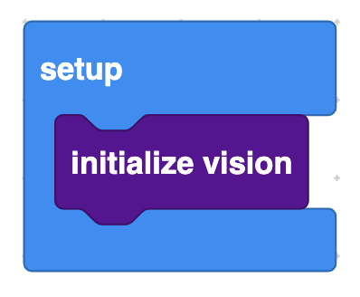

# CAIT Block Description

## Program Structure Blocks

	

**Description:** Perform setup steps, all initialize blocks goes within this block.   
**Usage:** Must be placed above a main block.  
* * *

	

**Description:** Main event loop. All program logic goes within this block.  
**Usage:** Must be placed after a setup block.  
* * *

	

**Description:** Initialize the vision module, must call before using any other vision blocks.  
**Usage:** Can only be use in a setup block.  
**Example:**   
	
* * *

