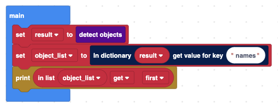
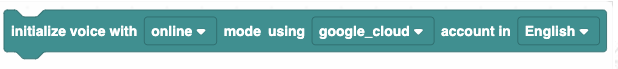
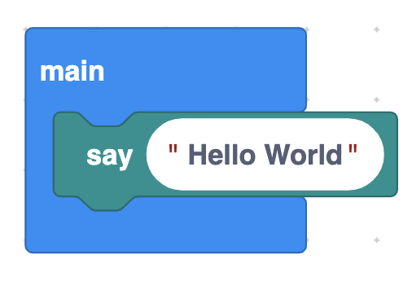

# CAIT Visual Programming Guide

CAIT's visual programming interface extends from Google's Blockly visual code editor.  Google provides a great [user's guide](https://developers.google.com/blockly/guides/overview) to Blockly.  We will not cover these basic concepts here.  Instead, we will talk the basic constructs that every program written for CAIT shares and describe the different A.I. blocks that you can use in your own project.

The main design goal of CAIT is to be intuitive and any program written for it should closely resemble simple structured programming.  For this reason, every program needs to have a least two blocks: a "setup" block and a "main" block.  The "setup" block can only contain initialization blocks for various A.I. modules, while the "main" block implements the program's logic flow.  We employ a sequential programming model in CAIT.  When a program executes, each of our A.I. block performs a specific task and waits for result to return before moving on to the next block.  The complexity of event handling and callbacks are effectively hidden within each block to offer users with an intuitive way to express their logic.

CAIT also offers a conversion tool to convert the visual code into either Jupyter notebook format or straight Python code.  The following describes the function of each custom block in CAIT.  These blocks have a one to one correspondence with the converted Python code statements.  

## Basic Blocks

	

**Description:** This block performs initialization of A.I. components.  Every program needs to have a "setup" block.  It corresponds to the "setup" function in the converted Python code.  
**Usage:** This block is usually placed above the "main" block.  
* * *

	

**Description:** Main event loop. All program logic goes within this block.  
**Usage:** Must be placed after a setup block.  
* * *

## AI Blocks

	

**Description:** Initialize the vision module, must call before using any other vision blocks.  
**Usage:** Can only be use in a setup block.  
**Example:**   
	
* * *

	

**Description:** Detect and recognize the largest face in the scene.   
**Usage:** Can only be use in a main block. Result is returned in the form of a dictionary, it can then be used with dictionary blocks.
**Return Data Example:**  {"name" : "Michael", "coordinate": [0, 0, 10, 10]}  
**Example:**   
	
* * *

	

**Description:** Add a new face to the face recognition database. 
**Usage:** Can only be use in a main block. The added face can be recognized with the Recognize Face block afterward.  
**Example:**   
	
* * *

	

**Description:** Remove an existing face from the face recognition database. 
**Usage:** Can only be use in a main block. The person with the removed face becomes Unknown after calling the Face Recognize block.  
**Example:**   
	
* * *

	

**Description:** Detect objects in the scene, returns a list of detected object and their coordinates.
**Usage:** Can only be use in a main block. Result is returned in the form of a combination of dictionary and list, it can then be used with dictionary and list blocks.  
**Return Data Example:**  {"name" : ["tv", "cellphone", "mouse"], "coordinate": [[0, 0, 10, 10], [10, 10, 120, 120], [20, 20, 40, 40], [30, 30, 70, 70]]}  
**Example:**   
	
* * *

	

**Description:** Classify the current scene, returns the top 5 possibile classes with correspondign confidences.
**Usage:** Can only be use in a main block. Result is returned in the form of a combination of dictionary and list, it can then be used with dictionary and list blocks.  
**Return Data Example:**  {"names" : [["cellphone", 0.799], ["iPod", 0.088], ["remote control", 0.0034], ["water bottle", 0.0022], ["Band Aid", 0.0015]}  
**Example:**   
	
* * *

	

**Description:** Initialize the speech module, must call before using any other speech blocks.  
**Usage:** Can only be use in a setup block. Use can choose to use online or on device mode. If using online mode, a google cloud accound must be associated with the system. Language option is only available in online mode.  
**Example:**   
	
* * *

	

**Description:** Listen for user's speech through microphone, then converts the speech to text.
**Usage:** Can only be use in a main block. Result is returned as a string. 
**Return Data Example:**  "Hi, nice to meet you"
**Example:**   
	
* * *

	

**Description:** Takes in a text and generate voice from it.
**Usage:** Can only be use in a main block.
**Example:**   
	
* * *

