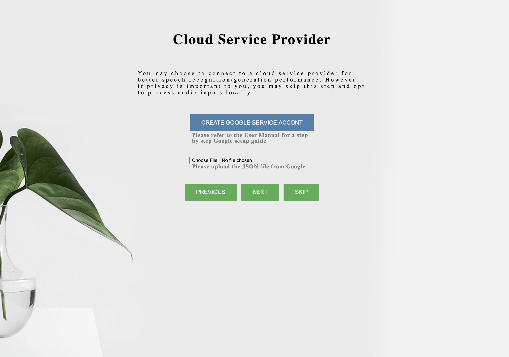
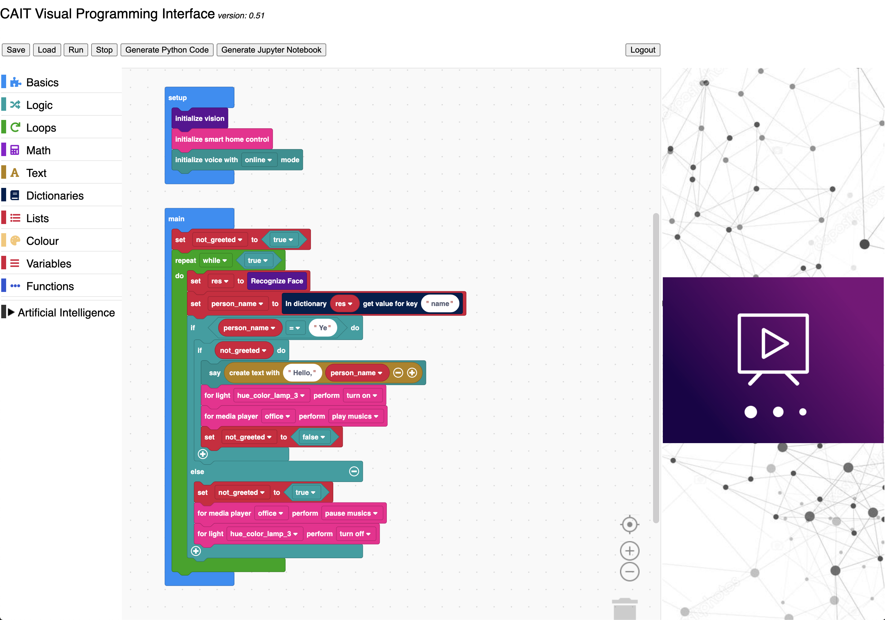
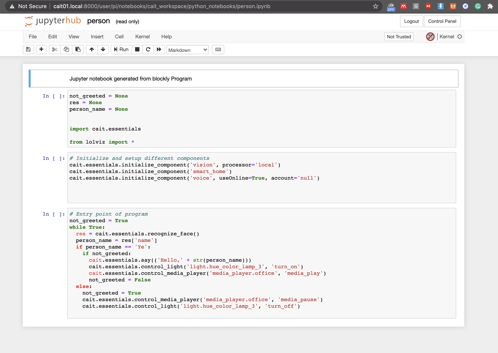

## Quick Start

### Using the visual programming interface:	

You can connect to the CAIT's visual programming interface using any computer, including the Raspberry Pi 4B that hosts CAIT, on the same local WIFI.  In the web browser, go to:	

```	
http://<hostname>.local	
```	

The first time you enter this address, you will be directed to a setup page, in which you will be asked to enter a new device name (hostname), and to create an user account for future login. 	

	

Next, you can test the functionality of any attached camera and audio device, to make sure you have connected the compatible ones.	

	

After that, you will be asked to signup for a google cloud service account for voice-related service, and upload the account file to the device.	

	

Finally, you need to reboot CAIT for everything to be applied.	

	

After the device is rebooted, enter the above address in browser, you can now login with your just created account. Alternatlivey, you can login with a default account to access sample programs:	

```	
username: pi	
password: raspberry	
```	

	

Once logged in, you can then create any program by drag-and-drop the basic programming blocks and Cortic AI blocks.	

	

### Configuring smart home devices:	

We integrated homeassistant into the toolkit, so that you can connect the device with your existing smart device by entering:	

```	
http://<hostname>.local:8213	
username: ai	
password: ai	
```	

Once you configured your smart devices, you will be able to control them in CAIT's visual programming interface.	

	

### Programming in Python with Jupyter Hub:	

We also integrated Jupyter hub and notebook support in CAIT, you can use it by entering:	

```	
http://<hostname>.local:8000	
```	

You can program with CAIT's AI functionalities in Python. Any program created in CAIT's visual programming interface can be converted to equivalen Python program and execture in here.	


